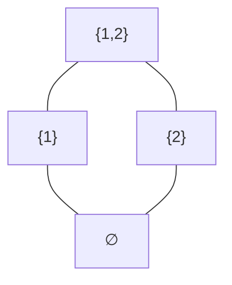

## The idea

A *lattice* is an order in which any two elements can be combined *upward* into a **join**
and *downward* into a **meet**. Those two words sound fancy but are simple once you see
them on an example — which is all this page is: joins and meets built from scratch, using
the subsets of a set as the running picture.

## An order first

Start with a collection of things and a way to say one is "below" another. Keep this
example in mind throughout: the **subsets of $\{1,2,3\}$, ordered by inclusion**
$\subseteq$. Here $\{1\}$ is below $\{1,2\}$ because $\{1\} \subseteq \{1,2\}$. But
$\{1\}$ and $\{2\}$ are **incomparable** — neither contains the other. An order where
some pairs are incomparable like this is a *partial order*.

It helps to draw it with "bigger" higher up (a *Hasse diagram*); lines mean "directly
below":

$\{1\}$ and $\{2\}$ sit side by side — incomparable — while everything flows up to
$\{1,2\}$ and down to the empty set.

## Upper bounds, and the join (least upper bound)

Pick two elements, say $\{1\}$ and $\{2\}$. An **upper bound** is anything sitting above
*both* of them. Above both here is $\{1,2\}$ (and in the full cube of $\{1,2,3\}$ also
$\{1,2,3\}$). Among all the upper bounds, the **least** one — the *lowest* ceiling that
still covers both — is the **join**, written $\{1\} \vee \{2\}$:

$$\{1\} \vee \{2\} = \{1,2\}$$

and that is just their **union**. In the subset order, *join = union*: the smallest set
containing both is the set of everything in either.

Two things worth stressing:

- There can be *many* upper bounds; the join is the single **smallest** one.
- The join isn't "some set above both" — it's the **tightest** such set.

## Lower bounds, and the meet (greatest lower bound)

Now flip it over. A **lower bound** of two elements sits below both; the **greatest**
lower bound — the *highest* floor still under both — is the **meet**, $a \wedge b$. Take
$\{1,2\}$ and $\{2,3\}$: the sets below both are the subsets of $\{2\}$, namely the empty
set and $\{2\}$, and the greatest of those is $\{2\}$:

$$\{1,2\} \wedge \{2,3\} = \{2\}$$

which is their **intersection**. In the subset order, *meet = intersection*.

## A lattice

::: {.definition title="Lattice"}
A **lattice** is a partial order in which *every* pair of elements has both a join
(least upper bound) and a meet (greatest lower bound).
:::

Some lattices you already know:

- **Subsets of a set, ordered by $\subseteq$** — join $=$ union, meet $=$ intersection.
  (This is the one that matters for Frankl.)
- **Numbers, ordered by $\le$** — join $=$ the larger, meet $=$ the smaller. Any chain is
  a lattice.
- **Divisors of $n$, ordered by "divides"** — join $=$ least common multiple, meet $=$
  greatest common divisor.

The common thread: a lattice always lets you combine two elements *upward* (join) and
*downward* (meet) and land on a single well-defined element.

## Union-closed families are lattices

One place these ideas show up: order a [union-closed]{.def} family of sets by $\subseteq$.
The join of $A$ and $B$ is their union $A \cup B$, and "union-closed" says exactly that
this join is **again a member**. (Meets — intersections — need not be.) So a union-closed
family is a lattice closed under joins. A related notion is a [join-irreducible]{.def}
element — one you cannot write as the join of two strictly smaller elements, a true
building block of the order. Both underlie the lattice restatement of
[Frankl's conjecture](frankl-union-closed.html).
